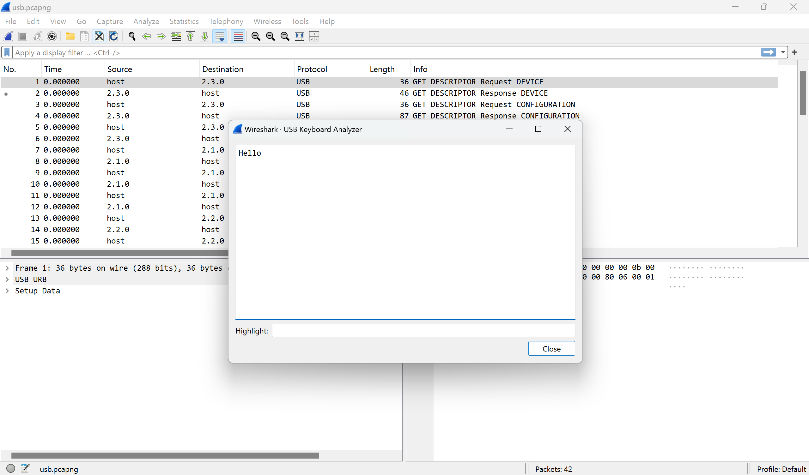

# Wireshark USB Keyboard Analyzer

Analyze the pressed USB keyboard keys.

## Installation

Clone this repository and copy it to the Wireshark plugin folder.

## Usage

`Tools` → `USB Keyboard Analyzer`
